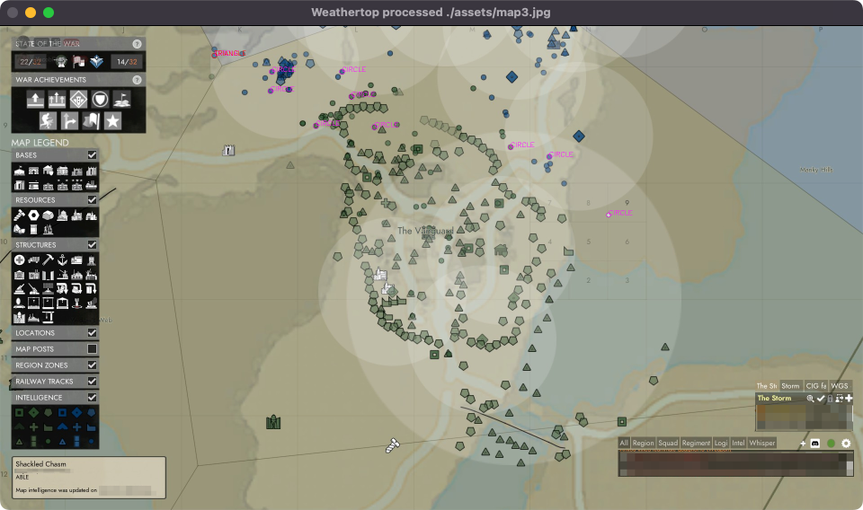

[](https://github.com/brianshef/weathertop/actions/workflows/python-package.yml)

# weathertop
An experimental early-warning system to be used with the game Foxhole. Named after the famous, ancient watchtower in Lord of the Rings.


*Development screenshot - Weathertop processed Foxhole map image*

## Prerequisities
- Python 3.12+
- [GNU Make](https://www.gnu.org/software/make/)
  - MacOS: `brew install make`
  - Windows:
    - [GNUWin32 on SourceForge](https://gnuwin32.sourceforge.net/packages/make.htm)
    - [Windows gnumake installation instructions](https://leangaurav.medium.com/how-to-setup-install-gnu-make-on-windows-324480f1da69)
  - Linux (WSL): `sudo apt-get install make`
- Install [pipenv](https://pypi.org/project/pipenv/)

## Installation

```
make install
```

#### Troubleshooting Installation

##### If there is an error about `setuptools`:

```
pipenv install setuptools
make install
```

##### Direct installation (without gnumake):
```
pipenv run python setup.py install
pipenv install
```

## Running locally

```
make run
```

#### Troubleshooting Running

##### Exiting

To exit, click on the `Weathertop` window to focus it, and then press any key on the keyboard.

##### Run directly (without gnumake):
```
pipenv run dragonfly
```

